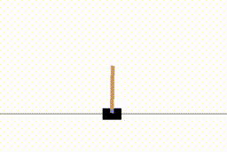
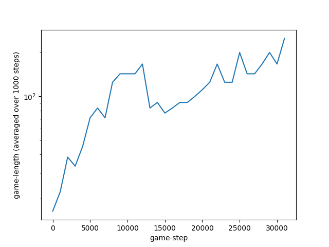

# reinforcement-learning

* inspired by https://github.com/lcswillems/pytorch-a2c-ppo

### [learning curve for DQN applied to Cartpole-Problem](reinforcement-learning/dqn_cartpole_minimal_example.py)
